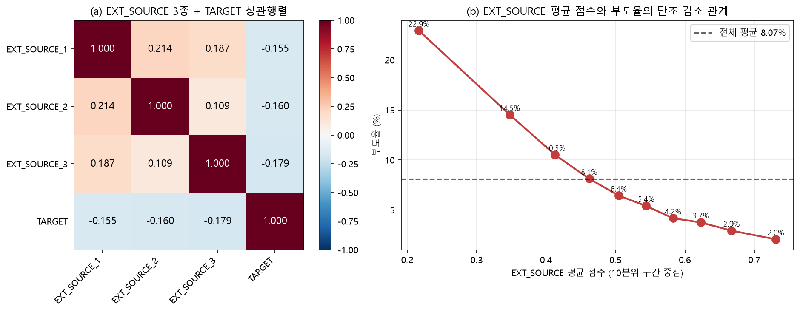
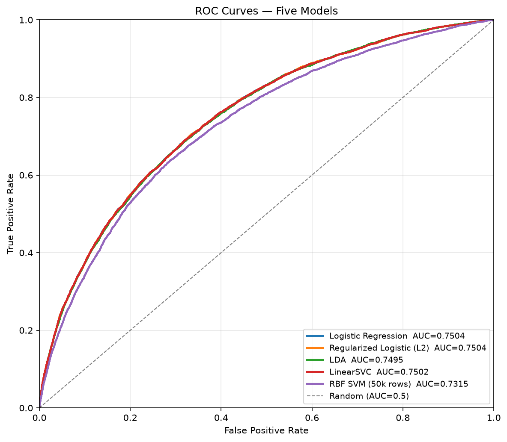
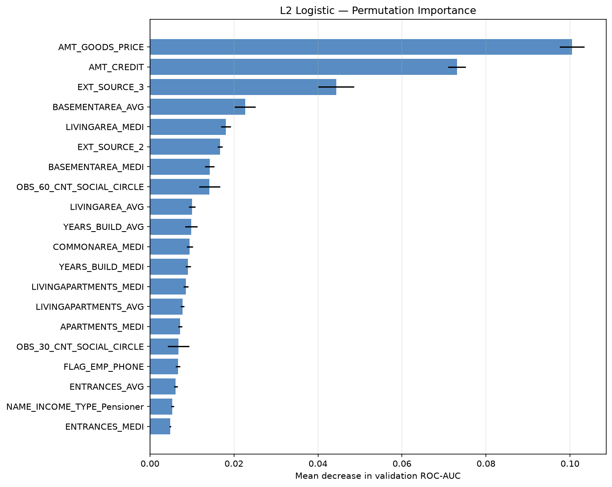
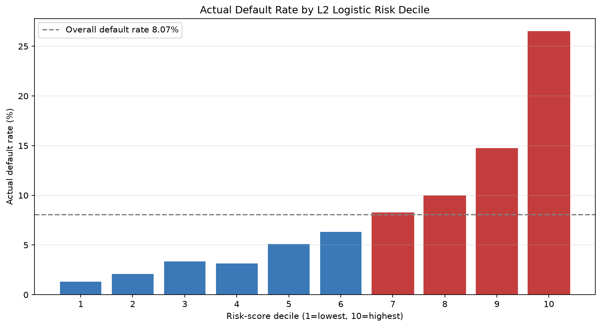

# Home Credit 채무불이행 위험 분석


> **문제** — 부도 고객이 8.07%인 불균형 대출 신청 데이터에서 고위험 신청자를 구분했습니다.<br>
> **한 일** — 307,511건을 검수하고 누수를 막은 전처리 후 5개 분류모델과 임계값을 비교했습니다.<br>
> **핵심 결과** — L2 Logistic ROC-AUC 0.7504, 위험 상위 10% 부도율 26.48%(전체 대비 3.28배)를 확인했습니다.<br>
> **차별점** — 희소 범주형 변수의 중요도를 과대평가한 오류를 발견하고 두 가지 검증 방법으로 수정했습니다.

## 이 프로젝트로 보여주는 역량

- 대용량·불균형 금융 데이터의 품질 검수와 데이터 누수 방지
- 불균형 분류 평가지표 선택과 임계값의 업무적 해석
- 분석 결과를 맹신하지 않고 오류를 발견·수정하는 검증 태도

## 핵심 결과

- 기준모델: L2 Logistic Regression
- 검증 ROC-AUC: 0.7504
- 위험 상위 10% 실제 부도율: 26.48%
- 전체 부도율 대비 Lift: 3.28배
- 기존 변수 중요도 해석 오류를 발견하고 수정

## 1. 프로젝트 배경

Home Credit은 금융 이력이 부족한 고객의 대출 상환 가능성을 평가하는 문제를 공개했습니다. 이 프로젝트에서는 `application_train.csv`를 이용해 채무불이행 위험을 분석했습니다.

기존 학부 팀 과제를 포트폴리오로 다시 구성하면서 모델 성능뿐 아니라 데이터 품질, 검증 절차, 결과 해석의 신뢰성을 함께 확인했습니다.

### 분석 목표

1. 원본 데이터의 결측치·이상코드·중복 여부를 확인합니다.
2. 데이터 누수를 막은 학습·검증 절차를 구성합니다.
3. 여러 분류모델의 성능과 계산시간을 비교합니다.
4. 위험도가 높은 신청자를 얼마나 잘 구분하는지 확인합니다.
5. 변수 중요도 해석 오류를 찾아 수정하고 한계를 기록합니다.

## 2. 사용 데이터

| 항목 | 내용 |
|---|---:|
| 분석 파일 | `application_train.csv` |
| 관측치 | 307,511건 |
| 원본 컬럼 | 122개 (`SK_ID_CURR`, `TARGET` 포함) |
| 원본 모델 입력 변수 | 120개 (`SK_ID_CURR`, `TARGET` 제외) |
| 파생변수 | 13개 |
| 전처리 전 모델 입력 | 133개 (원본 120 + 파생 13) |
| 원-핫 인코딩 후 차원 | 263개 |
| 예측 대상 | `TARGET` |
| 전체 부도율 | 8.07% |

원본 데이터는 용량과 배포 조건 때문에 저장소에 포함하지 않습니다. 내려받는 방법은 [`data/README.md`](data/README.md)에 정리했습니다.

## 3. 분석 파이프라인

```text
데이터 구조·품질 점검
→ 탐색적 데이터 분석
→ 이상코드 처리 및 파생변수 생성
→ 학습 80% / 검증 20% 층화 분할
→ 학습 데이터 기준 전처리
→ 5개 분류모델 비교
→ 교차검증·변수 중요도·임계값 점검
→ 위험 10분위 분석
```

분석은 다음 3개 노트북을 순서대로 실행합니다.

1. [`01_data_quality_preprocessing.ipynb`](notebooks/01_data_quality_preprocessing.ipynb)
2. [`02_exploratory_analysis.ipynb`](notebooks/02_exploratory_analysis.ipynb)
3. [`03_modeling_evaluation.ipynb`](notebooks/03_modeling_evaluation.ipynb)

## 4. 데이터 품질 관리

| 점검 항목 | 결과 |
|---|---:|
| `TARGET` 결측 | 0건 |
| 신청 ID 중복 | 0건 |
| train/test 신청 ID 중첩 | 0건 |
| 완전 중복 행 | 0건 |
| 수치형 무한값 | 0개 |

`DAYS_EMPLOYED=365243`은 55,374건이었습니다. 약 1,000년에 해당해 실제 근속기간으로 보기 어려우므로 결측값으로 바꾸고, 이상코드 존재 여부는 별도 변수로 남겼습니다.

### 데이터 누수 방지

- 신청 ID와 정답 컬럼은 모델 입력에서 제외했습니다.
- 데이터를 먼저 학습용과 검증용으로 나눴습니다.
- 결측치 대체값과 표준화 기준은 학습 데이터에서만 계산했습니다.
- 신청 시점을 확실히 구분하기 어려운 보조 테이블은 사용하지 않았습니다.

## 5. 탐색적 데이터 분석

외부 신용점수, 연령, 소득, 대출금액, 직업·교육 관련 범주를 중심으로 부도율 차이를 확인했습니다. 또한 상관계수와 분산팽창계수(VIF)를 이용해 서로 비슷한 정보를 가진 수치형 변수를 점검했습니다.



탐색 결과는 인과관계가 아니라 변수와 부도 여부 사이의 관련성으로만 해석했습니다.

## 6. 데이터 분할과 전처리

- 학습 데이터: 246,008건
- 검증 데이터: 61,503건
- 학습·검증 부도율: 각각 8.07%
- 파생변수: 재무 비율, 근속 비율, 외부 신용점수 요약 등 13개
- 불균형 처리: 데이터 복제·삭제 없이 클래스 가중치 적용

부도 고객이 전체의 8.07%이므로 정확도만 사용하지 않고 ROC-AUC, PR-AUC, 재현율, 정밀도와 위험구간별 부도율을 함께 확인했습니다.

## 7. 비교 모델

학부 통계·머신러닝 수업에서 다룬 다음 모델을 비교했습니다.

- Logistic Regression
- L2 Logistic Regression
- Linear Discriminant Analysis
- Linear SVM
- RBF SVM

RBF SVM은 계산시간 문제로 층화 추출한 5만 건만 학습했습니다. 따라서 다른 네 모델과 동일한 조건의 순위 비교로 해석하지 않았습니다.

## 8. 모델 평가 결과

| 모델 | 학습 데이터 | ROC-AUC | PR-AUC |
|---|---:|---:|---:|
| Logistic Regression | 246,008건 | 0.7504 | 0.2325 |
| L2 Logistic | 246,008건 | 0.7504 | 0.2324 |
| LinearSVC | 246,008건 | 0.7502 | 0.2338 |
| LDA | 246,008건 | 0.7495 | 0.2327 |
| RBF SVM | 50,000건 | 0.7315 | 0.2067 |

L2 Logistic을 기준모델로 선택했습니다. 최고 성능과 거의 같으면서 학습이 빠르고 결과를 비교적 쉽게 설명할 수 있기 때문입니다.



## 9. 변수 중요도 해석 오류 수정

기존 분석에서는 표준화된 수치형 변수와 0·1 범주형 더미변수의 로지스틱 계수를 그대로 비교했습니다. 변수의 단위와 분포가 다르므로 단순 계수 크기만으로 중요도를 비교하기 어렵습니다.

학습 데이터에서 각 변수가 실제로 변하는 정도를 반영해 효과 크기를 다시 계산하고, 검증 데이터의 변수를 섞었을 때 성능이 얼마나 감소하는지도 확인했습니다.

### 표준화 효과 기준 Top 10

`|로지스틱 계수 × 학습 데이터 표준편차|`를 기준으로 다시 정렬했습니다. 값은 [`logistic_standardized_effects.csv`](outputs/metrics/logistic_standardized_effects.csv)의 실제 산출값을 소수점 여섯째 자리까지 표시했습니다.

| 수정 후 순위 | 변수 | 수정 전 단순계수 순위 | 표준화 효과 절댓값 |
|---:|---|---:|---:|
| 1 | `AMT_GOODS_PRICE` | 1 | 0.952864 |
| 2 | `AMT_CREDIT` | 2 | 0.852951 |
| 3 | `EXT_SOURCE_3` | 11 | 0.397350 |
| 4 | `BASEMENTAREA_MEDI` | 12 | 0.380168 |
| 5 | `BASEMENTAREA_AVG` | 13 | 0.379019 |
| 6 | `LIVINGAREA_AVG` | 16 | 0.319534 |
| 7 | `LIVINGAPARTMENTS_MEDI` | 24 | 0.284869 |
| 8 | `LIVINGAREA_MEDI` | 27 | 0.278119 |
| 9 | `OBS_30_CNT_SOCIAL_CIRCLE` | 29 | 0.249354 |
| 10 | `EXT_SOURCE_2` | 30 | 0.247407 |

### 검증 데이터 순열 중요도 기준 Top 10

검증 데이터에서 변수 하나를 섞었을 때 ROC-AUC가 감소한 평균값입니다. 값은 [`logistic_permutation_importance.csv`](outputs/metrics/logistic_permutation_importance.csv)의 실제 산출값을 소수점 여섯째 자리까지 표시했습니다.

| 검증 순위 | 변수 | 수정 전 단순계수 순위 | ROC-AUC 평균 감소량 |
|---:|---|---:|---:|
| 1 | `AMT_GOODS_PRICE` | 1 | 0.100488 |
| 2 | `AMT_CREDIT` | 2 | 0.073064 |
| 3 | `EXT_SOURCE_3` | 11 | 0.044336 |
| 4 | `BASEMENTAREA_AVG` | 13 | 0.022666 |
| 5 | `LIVINGAREA_MEDI` | 27 | 0.018070 |
| 6 | `EXT_SOURCE_2` | 30 | 0.016700 |
| 7 | `BASEMENTAREA_MEDI` | 12 | 0.014228 |
| 8 | `OBS_60_CNT_SOCIAL_CIRCLE` | 31 | 0.014190 |
| 9 | `LIVINGAREA_AVG` | 16 | 0.010005 |
| 10 | `YEARS_BUILD_AVG` | 35 | 0.009817 |



수정 전 3위였던 `ORGANIZATION_TYPE_Realtor`는 표준화 효과 기준 93위, 6위였던 `ORGANIZATION_TYPE_Transport: type 3`은 88위로 내려가 희소 조직유형 중심 해석을 철회했습니다. 반면 `EXT_SOURCE_3`과 `EXT_SOURCE_2`는 두 검증 방법 모두 Top 10에 포함돼 외부 신용점수 계열이 일관된 상위 신호임을 확인했습니다. `AMT_CREDIT`과 `AMT_GOODS_PRICE`도 상위에 남았지만 서로 강하게 연관된 변수이므로, 개별 계수의 부호를 원인으로 해석하지 않고 **대출 규모와 관련된 묶음 신호**로만 해석했습니다. 이 과정은 결과를 맹신하지 않고 기준을 맞춰 다시 검증한 프로젝트의 핵심 수정 사항입니다.

## 10. 위험구간 분석

L2 Logistic 위험점수를 10개 구간으로 나눴습니다. 위험 상위 10%의 실제 부도율은 26.48%로 전체 부도율 8.07%의 3.28배였습니다.



### 10.1 여신 심사 활용과 임계값

위험 상위 10%의 부도율이 전체의 3.28배라는 결과는 한정된 심사 인력을 어느 신청 건에 먼저 배치할지 정하는 우선순위 신호로 활용할 수 있습니다. 상위 구간부터 소득·재직 정보나 추가 서류를 확인하면 모든 신청 건을 같은 강도로 검토하는 것보다 심사 자원을 집중할 근거가 됩니다.

부도 고객을 놓치면 대손 위험이 커지고, 정상 고객을 고위험으로 분류하면 거절·지연에 따른 기회손실이 생깁니다. 두 비용의 크기가 다르므로 하나의 임계값을 정답으로 두지 않고 [`threshold_scenarios.csv`](outputs/metrics/threshold_scenarios.csv)의 실제 결과를 비교했습니다.

| 임계값 시나리오 | 임계값 | Recall | Precision | 비용 관점의 의미 |
|---|---:|---:|---:|---|
| 기본 임계 | 0.50 | 68.12% | 16.09% | 기준 비교점 |
| F1 최대화 | 0.66 | 42.68% | 23.20% | 검토 대상의 부도 비율은 높지만 더 많은 부도 고객을 놓침 |
| Recall 80% 이상 | 0.41 | 80.00% | 13.48% | 부도 누락을 줄이는 대신 더 많은 정상 고객을 추가 검토 |

대손 위험을 더 크게 본다면 0.41처럼 Recall을 높인 임계값을 검토할 수 있지만, 심사량과 정상 고객의 기회손실도 함께 커집니다. 따라서 이 모델은 **자동 승인·거절기가 아니라 인적 심사 우선순위를 정하는 보조도구**로 사용해야 합니다. 또한 신청 테이블만 사용한 학부 프로젝트이므로 실제 여신 정책에 적용하려면 상환 이력 결합, 시점 검증과 비용 기준 합의가 추가로 필요합니다.

## 11. 프로젝트 구조

```text
home-credit-default-risk/
├─ config.yaml
├─ requirements.txt
├─ data/
│  ├─ README.md
│  ├─ raw/
│  └─ processed/
├─ notebooks/
│  ├─ 01_data_quality_preprocessing.ipynb
│  ├─ 02_exploratory_analysis.ipynb
│  └─ 03_modeling_evaluation.ipynb
├─ outputs/
│  ├─ figures/
│  ├─ metrics/
│  ├─ models/
│  └─ reports/
└─ docs/
   ├─ findings.md
   ├─ portfolio_description.md
   └─ consistency_audit.md
```

## 12. 주요 산출물

| 구분 | 파일 | 설명 |
|---|---|---|
| 성능표 | [`model_holdout_performance.csv`](outputs/metrics/model_holdout_performance.csv) | 모델별 홀드아웃 성능과 학습시간 |
| 교차검증 | [`cross_validation_summary.csv`](outputs/metrics/cross_validation_summary.csv) | 5겹 교차검증 평균과 표준편차 |
| 임계값 | [`threshold_scenarios.csv`](outputs/metrics/threshold_scenarios.csv) | 기본·F1 최대·Recall 80% 시나리오 |
| 위험구간 | [`risk_decile_summary.csv`](outputs/metrics/risk_decile_summary.csv) | 위험 10분위별 실제 부도율과 Lift |
| 분석 보고서 | [`findings.md`](docs/findings.md) | 결과 해석, 수정 사항, 한계 |
| 수치 검증 | [`consistency_audit.md`](docs/consistency_audit.md) | README·보고서·CSV 간 핵심 수치 교차검증 |

전체 산출물 설명은 [`outputs/README.md`](outputs/README.md)에서 확인할 수 있습니다.

## 13. 실행 방법

### 13.1 저장소와 데이터 준비

저장소를 내려받은 뒤 [`data/README.md`](data/README.md)에 따라 Kaggle 원본 CSV를 배치합니다.

### 13.2 가상환경 설치

```powershell
python -m venv .venv
.\.venv\Scripts\python.exe -m pip install -r requirements.txt
.\.venv\Scripts\python.exe -m jupyter lab
```

### 13.3 노트북 실행

JupyterLab에서 01번부터 03번까지 순서대로 실행합니다. 경로, 난수값, 검증 비율은 `config.yaml`에서 관리합니다.

## 14. 결과 해석 시 주의사항

- ROC-AUC는 위험 순위를 구분하는 능력을 나타내며 정확한 부도확률을 뜻하지 않습니다.
- 0.5 임계값은 업무 목적에 따라 조정해야 합니다.
- 변수 중요도는 인과관계를 의미하지 않습니다.
- RBF SVM은 학습 표본 수가 달라 보조 결과로만 봐야 합니다.

## 15. 한계와 개선 방향

- 신청 테이블만 사용해 과거 신용·상환 이력을 충분히 반영하지 못했습니다.
- 무작위 분할이므로 실제 미래 시점 성능을 검증한 것은 아닙니다.
- 모델의 확률 보정과 집단별 공정성 검토는 수행하지 않았습니다.
- 향후 보조 테이블의 기준 시점을 확인한 뒤 결합하고, 시점 기반 검증을 추가할 수 있습니다.

## 16. 결론

복잡한 모델보다 먼저 데이터 품질과 검증 절차를 확인했고, 기존 변수 중요도 해석의 문제를 발견해 수정했습니다. 기준모델은 위험 상위 10%에서 전체보다 3.28배 높은 부도율을 보여, 추가 확인 대상을 정하는 보조 지표로 활용할 가능성을 확인했습니다.
